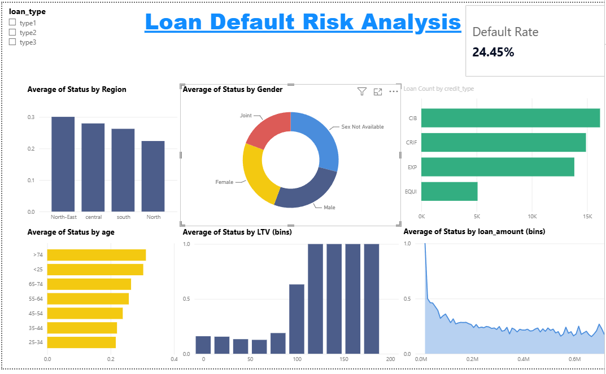
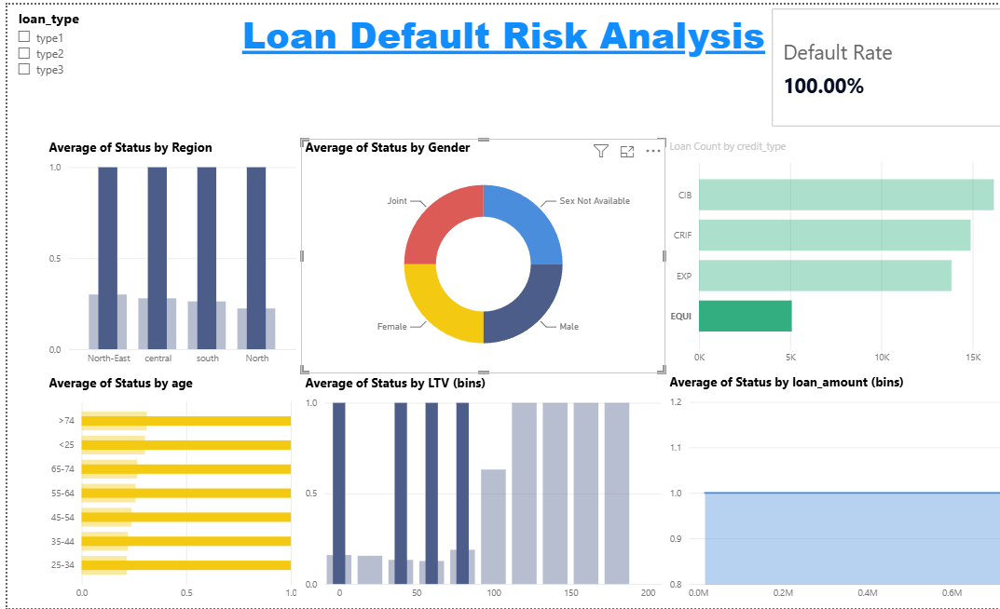
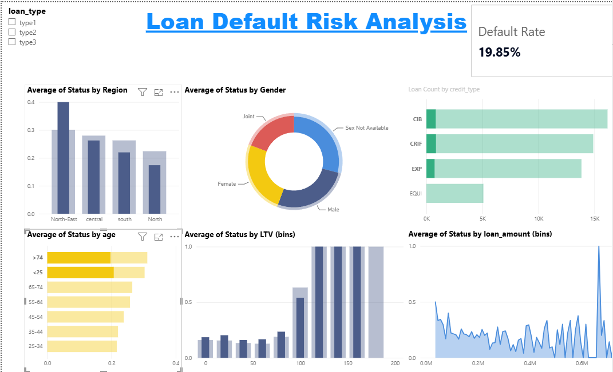

# Loan Default Risk Analysis

## Summary

Analysis of 50,000 loan records found an overall default rate of 24.45%, 
with loans at LTV ratios between 100–180 defaulting at 67.32% — nearly 
3x the baseline rate.

## Project Overview

This project uses Power BI to analyze factors associated with loan default risk. The dashboard explores demographic and financial characteristics of borrowers to identify trends and segments associated with higher observed default rates.

## Tools Used

* Power BI
* Power Query
* DAX

## Dashboard Overview

The dashboard provides an interactive view of default rates across borrower demographics and loan characteristics, including region, age group, loan amount, and loan-to-value (LTV) ratios.

## Exploratory Analysis: EQUI Credit Type

During exploratory analysis, the EQUI credit type exhibited a 100% observed default rate across 5,090 records within this dataset. Additional investigation was conducted to determine whether related variables or filtering effects contributed to this pattern. This process highlighted the importance of validating unusual findings before drawing conclusions.

## Interactive Filtering Example

Interactive slicers were used to examine how default rates changed across different borrower segments. These filters enabled deeper exploration of subgroup behavior and supported the identification of potential outliers.

## Key Findings

- The overall observed default rate across 50,000 loan records was 24.45%.
- Loans with LTV ratios between 100–180 had a default rate of 67.32%, 
  nearly 3x the overall baseline.
- Default rates varied across regions and age groups.
- The EQUI credit type showed a 100% default rate across all 5,090 
  records in that subgroup. A rate this uniform across a subgroup this 
  size is more consistent with a data artifact (e.g., how EQUI loans 
  were labeled or sourced) than a genuine risk signal, and would need 
  validation against the data dictionary or source system before being 
  treated as a real finding — a good example of why exploratory results 
  should be sanity-checked rather than reported at face value.
- Interactive filtering capabilities allowed for deeper borrower 
  segment analysis.

## Skills Demonstrated

* Exploratory Data Analysis (EDA)
* Data Cleaning and Validation
* Dashboard Development
* DAX Measure Creation
* Business Intelligence Reporting
* Data Visualization
